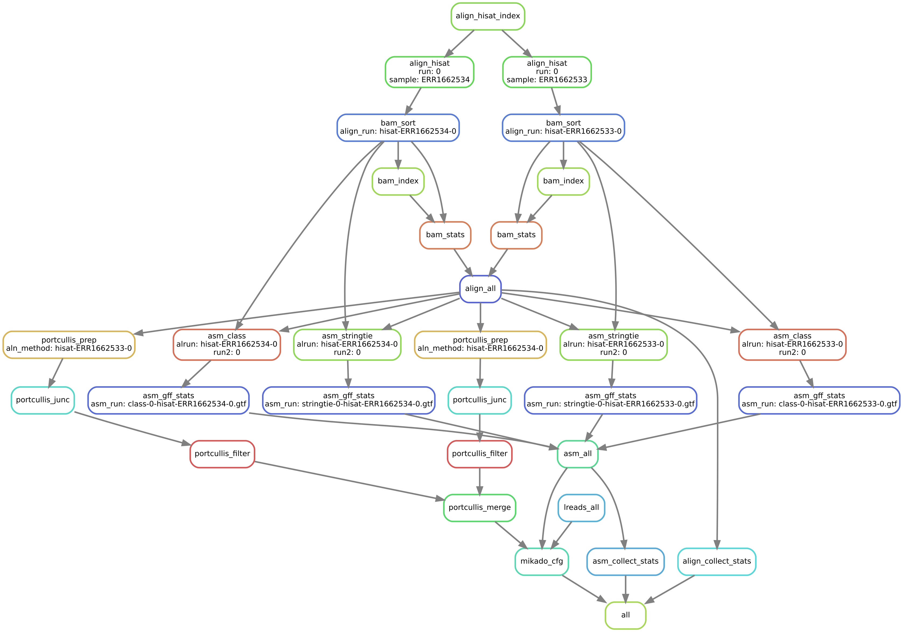
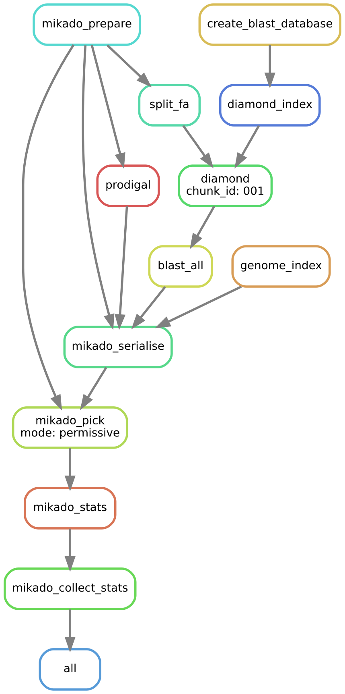

.. _PRJEB15540: http://www.ebi.ac.uk/ena/data/view/PRJEB15540
.. _ERX1732854: http://www.ebi.ac.uk/ena/data/view/ERX1732854
.. _ERX1732855: http://www.ebi.ac.uk/ena/data/view/ERX1732855
.. _ERR1662533_1.fastq.gz: ftp://ftp.sra.ebi.ac.uk/vol1/fastq/ERR166/003/ERR1662533/ERR1662533_1.fastq.gz
.. _ERR1662533_2.fastq.gz: ftp://ftp.sra.ebi.ac.uk/vol1/fastq/ERR166/003/ERR1662533/ERR1662533_2.fastq.gz
.. _ERR1662534_1.fastq.gz: ftp://ftp.sra.ebi.ac.uk/vol1/fastq/ERR166/003/ERR1662534/ERR1662534_1.fastq.gz
.. _ERR1662534_2.fastq.gz: ftp://ftp.sra.ebi.ac.uk/vol1/fastq/ERR166/003/ERR1662534/ERR1662534_2.fastq.gz

.. _Daijin-Tutorial:

Tutorial for Daijin
===================

This tutorial will guide you through the task of configuring and running the whole Daijin pipeline on a *Drosophila melanogaster* dataset comprising two different samples, using one aligner (HISAT) and two assemblers (Stringtie and CLASS2) as chosen methods. A modern desktop computer with a multicore processor and 4GB of RAM or more should suffice to execute the pipeline within two hours.

.. warning:: Please note that **development of Daijin Assemble has now been discontinued**.
	     Daijin will be superseded by a different pipeline manager, which is currently in the works. We will continue actively maintening the
	     "mikado" part of the pipeline, which is dedicated to run the steps between a set of input transcript assemblies and/or cDNA alignments until
	     the final Mikado output.

Overview
~~~~~~~~

The tutorial will guide you through the following tasks:

#. Configuring Daijin to analyse the chosen data
#. Running the alignment and assemblies using ``daijin assemble``
#. Running the Mikado analysis using ``daijin mikado``
#. Comparing the results against the reference transcriptome

Required software
~~~~~~~~~~~~~~~~~

Mikado should be installed and configured properly (see our :ref:`installation instructions <Installation>`). Additionally, you should have the following software tools at disposal (between brackets is indicated the version used at the time of the writing):

* DIAMOND (v0.8.22 or later)
* Prodigal (v2.6.3 or later)
* Portcullis (v1.0.2 or later)
* HISAT2 (v2.0.4)
* Stringtie (v1.2.4)
* CLASS2 (v2.12)
* SAMtools (v1.1 or later)

Input data
~~~~~~~~~~

Throughout this tutorial, we will use data coming from EnsEMBL v89, and from the PRJEB15540_ experiment on ENA. In particular, we will need:

 * the `genome FASTA file <ftp://ftp.ensembl.org/pub/release-89/fasta/drosophila_melanogaster/dna/Drosophila_melanogaster.BDGP6.dna.toplevel.fa.gz>`_ of *Drosophila melanogaster*
 * its `relative genome annotation <ftp://ftp.ensembl.org/pub/release-89/gtf/drosophila_melanogaster/Drosophila_melanogaster.BDGP6.89.gtf.gz>`_
 * RNA-Seq from two samples of the PRJEB15540_ study:

     * ERX1732854_, left (`ERR1662533_1.fastq.gz`_) and right (`ERR1662533_2.fastq.gz`_) reads
     * ERX1732855_, left (`ERR1662534_1.fastq.gz`_) and right (`ERR1662534_2.fastq.gz`_) reads
 * protein sequences for the related species *Aedes aegypti*, `downloaded from Uniprot <"http://www.uniprot.org/uniprot/?sort=score&desc=&compress=yes&query=taxonomy:diptera%20NOT%20taxonomy:%22Drosophila%20(fruit%20flies)%20[7215]%22%20AND%20taxonomy:%22Aedes%20aegypti%22&fil=&format=fasta&force=yes">`_

Preparation of the input data
~~~~~~~~~~~~~~~~~~~~~~~~~~~~~

First of all, let us set up a folder with the reference data::

    mkdir -p Reference;
    cd Reference;
    wget ftp://ftp.ensembl.org/pub/release-89/gtf/drosophila_melanogaster/Drosophila_melanogaster.BDGP6.89.gtf.gz;
    wget ftp://ftp.ensembl.org/pub/release-89/fasta/drosophila_melanogaster/dna/Drosophila_melanogaster.BDGP6.dna.toplevel.fa.gz;
    wget "http://www.uniprot.org/uniprot/?sort=score&desc=&compress=yes&query=taxonomy:diptera%20NOT%20taxonomy:%22Drosophila%20(fruit%20flies)%20[7215]%22%20AND%20taxonomy:%22Aedes%20aegypti%22&fil=&format=fasta&force=yes" -O Aedes_aegypti.fasta.gz;
    gunzip *gz;
    cd ../;

The snippet of the bash script above will create a "Reference" directory, download the genome of *D. melanogaster* in FASTA file, the corresponding GTF, and the protein sequences for *Aedes aegypti*. It will also decompress all files.

It is possible to have a feel for the annnotation of this species - the size of its genes and transcripts, the average number of exons per transcript, etc - by using ``mikado util stats``; just issue the following command::

  mikado util stats Reference/Drosophila_melanogaster.BDGP6.89.gtf Reference/Drosophila_melanogaster.BDGP6.89.stats.txt 2> Reference/stats.err

These are the results:

+----------------------------------+-----------+-----------+--------+------------+---------+--------+--------+-------+----------+-------+--------+--------+--------+-----------+
| Stat                             | Total     | Average   | Mode   | Min        | 1%      | 5%     | 10%    | 25%   | Median   | 75%   | 90%    | 95%    | 99%    | Max       |
+==================================+===========+===========+========+============+=========+========+========+=======+==========+=======+========+========+========+===========+
| Number of genes                  | 17559     | NA        | NA     | NA         | NA      | NA     | NA     | NA    | NA       | NA    | NA     | NA     | NA     | NA        |
+----------------------------------+-----------+-----------+--------+------------+---------+--------+--------+-------+----------+-------+--------+--------+--------+-----------+
| Number of genes (coding)         | 13898     | NA        | NA     | NA         | NA      | NA     | NA     | NA    | NA       | NA    | NA     | NA     | NA     | NA        |
+----------------------------------+-----------+-----------+--------+------------+---------+--------+--------+-------+----------+-------+--------+--------+--------+-----------+
| Number of monoexonic genes       | 4772      | NA        | NA     | NA         | NA      | NA     | NA     | NA    | NA       | NA    | NA     | NA     | NA     | NA        |
+----------------------------------+-----------+-----------+--------+------------+---------+--------+--------+-------+----------+-------+--------+--------+--------+-----------+
| Transcripts per gene             | 34740     | 1.98      | 1      | 1          | 1       | 1      | 1      | 1     | 1        | 2     | 4      | 5      | 10     | 75        |
+----------------------------------+-----------+-----------+--------+------------+---------+--------+--------+-------+----------+-------+--------+--------+--------+-----------+
| Coding transcripts per gene      | 30308     | 1.73      | 1      | 0          | 0       | 0      | 0      | 1     | 1        | 2     | 4      | 5      | 10     | 69        |
+----------------------------------+-----------+-----------+--------+------------+---------+--------+--------+-------+----------+-------+--------+--------+--------+-----------+
| CDNA lengths                     | 90521553  | 2,605.69  | 22     | 20         | 58      | 322    | 526    | 988   | 1,888    | 3,373 | 5,361  | 7,025  | 11,955 | 71,382    |
+----------------------------------+-----------+-----------+--------+------------+---------+--------+--------+-------+----------+-------+--------+--------+--------+-----------+
| CDNA lengths (mRNAs)             | 87158361  | 2,875.75  | 1023   | 108        | 379     | 571    | 748    | 1,247 | 2,147    | 3,628 | 5,636  | 7,312  | 12,444 | 71,382    |
+----------------------------------+-----------+-----------+--------+------------+---------+--------+--------+-------+----------+-------+--------+--------+--------+-----------+
| CDS lengths                      | 59968005  | 1,726.19  | 0      | 0          | 0       | 0      | 0      | 525   | 1,212    | 2,142 | 3,702  | 5,106  | 9,648  | 68,847    |
+----------------------------------+-----------+-----------+--------+------------+---------+--------+--------+-------+----------+-------+--------+--------+--------+-----------+
| CDS lengths (mRNAs)              | NA        | 1,978.62  | 372    | 33         | 177     | 315    | 435    | 780   | 1,404    | 2,361 | 3,915  | 5,480  | 10,149 | 68,847    |
+----------------------------------+-----------+-----------+--------+------------+---------+--------+--------+-------+----------+-------+--------+--------+--------+-----------+
| CDS/cDNA ratio                   | NA        | 67.88     | 75.0   | 1          | 14      | 29     | 40     | 56    | 71       | 83    | 91     | 94     | 99     | 100       |
+----------------------------------+-----------+-----------+--------+------------+---------+--------+--------+-------+----------+-------+--------+--------+--------+-----------+
| Monoexonic transcripts           | 5899      | 882.90    | 22     | 20         | 21      | 25     | 73     | 288   | 640      | 1,154 | 1,898  | 2,470  | 4,517  | 21,216    |
+----------------------------------+-----------+-----------+--------+------------+---------+--------+--------+-------+----------+-------+--------+--------+--------+-----------+
| MonoCDS transcripts              | 4269      | 912.26    | 372    | 33         | 114     | 186    | 249    | 402   | 723      | 1,227 | 1,789  | 2,153  | 3,721  | 9,405     |
+----------------------------------+-----------+-----------+--------+------------+---------+--------+--------+-------+----------+-------+--------+--------+--------+-----------+
| Exons per transcript             | 186414    | 5.37      | 1      | 1          | 1       | 1      | 1      | 2     | 4        | 7     | 11     | 15     | 24     | 82        |
+----------------------------------+-----------+-----------+--------+------------+---------+--------+--------+-------+----------+-------+--------+--------+--------+-----------+
| Exons per transcript (mRNAs)     | 3715      | 5.93      | 2      | 1          | 1       | 1      | 2      | 3     | 4        | 8     | 12     | 15     | 26     | 82        |
+----------------------------------+-----------+-----------+--------+------------+---------+--------+--------+-------+----------+-------+--------+--------+--------+-----------+
| Exon lengths                     | NA        | 485.59    | 156    | 1          | 33      | 69     | 93     | 145   | 251      | 554   | 1,098  | 1,606  | 3,303  | 28,074    |
+----------------------------------+-----------+-----------+--------+------------+---------+--------+--------+-------+----------+-------+--------+--------+--------+-----------+
| Exon lengths (mRNAs)             | NA        | 485.18    | 156    | 1          | 36      | 70     | 95     | 146   | 250      | 554   | 1,102  | 1,612  | 3,277  | 28,074    |
+----------------------------------+-----------+-----------+--------+------------+---------+--------+--------+-------+----------+-------+--------+--------+--------+-----------+
| Intron lengths                   | NA        | 1,608.99  | 61     | 2          | 52      | 55     | 58     | 63    | 102      | 742   | 3,482  | 7,679  | 25,852 | 257,022   |
+----------------------------------+-----------+-----------+--------+------------+---------+--------+--------+-------+----------+-------+--------+--------+--------+-----------+
| Intron lengths (mRNAs)           | NA        | 1,597.85  | 61     | 23         | 52      | 55     | 58     | 63    | 102      | 744   | 3,472  | 7,648  | 25,529 | 257,022   |
+----------------------------------+-----------+-----------+--------+------------+---------+--------+--------+-------+----------+-------+--------+--------+--------+-----------+
| CDS exons per transcript         | 2761      | 4.60      | 2      | 0          | 0       | 0      | 0      | 1     | 3        | 6     | 10     | 13     | 23     | 81        |
+----------------------------------+-----------+-----------+--------+------------+---------+--------+--------+-------+----------+-------+--------+--------+--------+-----------+
| CDS exons per transcript (mRNAs) | 2761      | 5.27      | 2      | 1          | 1       | 1      | 1      | 2     | 4        | 7     | 11     | 14     | 24     | 81        |
+----------------------------------+-----------+-----------+--------+------------+---------+--------+--------+-------+----------+-------+--------+--------+--------+-----------+
| CDS exon lengths                 | 59968005  | 375.21    | 156    | 1          | 12      | 48     | 73     | 123   | 197      | 407   | 848    | 1,259  | 2,523  | 27,705    |
+----------------------------------+-----------+-----------+--------+------------+---------+--------+--------+-------+----------+-------+--------+--------+--------+-----------+
| CDS Intron lengths               | 165622620 | 1,278.75  | 60     | 22         | 51      | 54     | 56     | 61    | 81       | 525   | 2,503  | 5,629  | 21,400 | 257,021   |
+----------------------------------+-----------+-----------+--------+------------+---------+--------+--------+-------+----------+-------+--------+--------+--------+-----------+
| 5'UTR exon number                | 30308     | 1.52      | 1      | 0          | 0       | 1      | 1      | 1     | 1        | 2     | 2      | 3      | 4      | 13        |
+----------------------------------+-----------+-----------+--------+------------+---------+--------+--------+-------+----------+-------+--------+--------+--------+-----------+
| 3'UTR exon number                | 30308     | 1.11      | 1      | 0          | 1       | 1      | 1      | 1     | 1        | 1     | 1      | 2      | 4      | 29        |
+----------------------------------+-----------+-----------+--------+------------+---------+--------+--------+-------+----------+-------+--------+--------+--------+-----------+
| 5'UTR length                     | 9330312   | 307.85    | 0      | 0          | 0       | 21     | 39     | 87    | 185      | 407   | 702    | 960    | 1,684  | 5,754     |
+----------------------------------+-----------+-----------+--------+------------+---------+--------+--------+-------+----------+-------+--------+--------+--------+-----------+
| 3'UTR length                     | 17860044  | 589.28    | 3      | 0          | 3       | 45     | 68     | 126   | 299      | 724   | 1,398  | 2,079  | 4,048  | 18,497    |
+----------------------------------+-----------+-----------+--------+------------+---------+--------+--------+-------+----------+-------+--------+--------+--------+-----------+
| Stop distance from junction      | NA        | 31.30     | 0      | 0          | 0       | 0      | 0      | 0     | 0        | 0     | 0      | 23     | 1,027  | 10,763    |
+----------------------------------+-----------+-----------+--------+------------+---------+--------+--------+-------+----------+-------+--------+--------+--------+-----------+
| Intergenic distances             | NA        | 1,991.60  | 235    | -1,472,736 | -42,934 | -6,222 | -1,257 | 37    | 335      | 1,894 | 9,428  | 18,101 | 47,477 | 1,125,562 |
+----------------------------------+-----------+-----------+--------+------------+---------+--------+--------+-------+----------+-------+--------+--------+--------+-----------+
| Intergenic distances (coding)    | NA        | 2,842.58  | 1      | -351,626   | -38,336 | -4,836 | -316   | 58    | 347      | 1,798 | 10,218 | 21,258 | 56,471 | 932,526   |
+----------------------------------+-----------+-----------+--------+------------+---------+--------+--------+-------+----------+-------+--------+--------+--------+-----------+

From this summary it is quite apparent that the *D. melanogaster* genome preferentially encodes multiexonic transcripts, which on average have ~30% of their sequence in UTRs. Intron lengths are generally over 1.5 kbps, with a very long maximum value of approximately 257 kbps. Genes on average are separated by 3 kbps stretches of intergenic regions, although there is considerable variation, with over 25% of the genes overlapping one another.

Next, we download the reads that we will use for this example::

  mkdir -p Reads;
  cd Reads;
  wget ftp://ftp.sra.ebi.ac.uk/vol1/fastq/ERR166/003/ERR1662533/ERR1662533_1.fastq.gz;
  wget ftp://ftp.sra.ebi.ac.uk/vol1/fastq/ERR166/003/ERR1662533/ERR1662533_2.fastq.gz;
  wget ftp://ftp.sra.ebi.ac.uk/vol1/fastq/ERR166/004/ERR1662534/ERR1662534_1.fastq.gz;
  wget ftp://ftp.sra.ebi.ac.uk/vol1/fastq/ERR166/004/ERR1662534/ERR1662534_2.fastq.gz;
  cd ../;

These files have a total file size of approximately 4GB, so they might take five to ten minutes to download, depending on your connection speed.

.. _tutorial-daijin-configure:

Step 1: configuring Daijin
~~~~~~~~~~~~~~~~~~~~~~~~~~

The first task is to create a configuration file for Daijin using ``daijin configure``. On the command line, we have to configure the following:

* name of the configuration file (daijin.yaml)
* number of threads per process (2)
* reference genome and the name of the species (**without spaces or non-ASCII/special characters**)
* reads to use, with their strandedness and the name of the sample
* aligners (HISAT2) and assemblers (Stringtie, CLASS2)
* output directory (Dmelanogaster)
* the scoring file to use for Mikado pick; we will ask to copy it in-place to have a look at it (dmelanogaster_scoring.yaml)
* the protein database for homology searches for Mikado (Aedes_aegypti.fasta)
* flank: as *D. melanogaster* has a relatively compact genome, we should decrease the maximum distance for grouping together transcripts. We will decrease from 1kbps (default) to 500.
* (optional) the scheduler to use for the cluster (we will presume that the job is being executed locally)
* (optional) name of the cluster configuration file, which will have to be edited manually.

First, we will create a sample sheet, containing the information of the sample that we are going to use. This is a tab-delimited text file, where each line defines a single sample, and with up to 5 columns per line. The first three columns are mandatory, while the last two are optional. The columns are as follows:

 * **Read1**: required. Location of the left reads for the sample.
 * **Read2**: optional, location of the right reads for the sample if it is paired.
 * **Sample**: name of the sample. Required.
 * **Strandedness**: strandedness of the sample. It can be one of:
 
    * fr-unstranded (Unstranded data)
    * fr-firststrand (Stranded data, first read forward, second read reverse)
    * fr-secondstrand (Stranded data, second read forward, first read reverse)
    * f (Forward, single read only)
    * r (Reverse, single read only)
 * **Long read sample**: Boolean flag. If set to "True", the sample will be considered as coming from a non-second generation sequencing platform (eg. Sanger ESTs or PacBio IsoSeq) and for its reads we would therefore consider only the alignment, without performing any assembly.

For our example, therefore, the sample sheet will look like this::

    Reads/ERR1662533_1.fastq.gz	Reads/ERR1662533_2.fastq.gz	ERR1662533	fr-unstranded	False
    Reads/ERR1662534_1.fastq.gz	Reads/ERR1662534_2.fastq.gz	ERR1662534	fr-unstranded	False

Write this into a text file called "sample_sheet.tsv".
Now we will configure Daijin for the run::

  daijin configure --scheduler "" \
       --scoring dmelanogaster_scoring.yaml \
       --copy-scoring dmelanogaster_scoring.yaml \
       -m permissive --sample-sheet sample_sheet.tsv \
       --flank 500 -i 50 26000 --threads 2 \
       --genome Reference/Drosophila_melanogaster.BDGP6.dna.toplevel.fa \
       -al hisat -as class stringtie -od Dmelanogaster -name Dmelanogaster \
       -o daijin.yaml --prot-db Reference/Aedes_aegypti.fasta;

This will create three files in the working directory:

  * **daijin.yaml**, the main configuration file. This file is in `YAML format <http://www.yaml.org/spec/1.2/spec.html>`_.
  * *dmelanogaster.yaml*: this file is a copy of the scoring configuration file. Please refer to the :ref:`dedicated section <scoring_files>` for details.
  * *daijin_exe.yaml*: this small configuration file contains the instruction to load the necessary software into the working environment. Ignore it if you are working on a local machine. If you are working within a cluster environment, please modify this file with the normal commands you would use in a cluster script to load necessary software. For example, this is how this file looks like on our own cluster system:

.. code-block:: yaml

    blast: 'source blast-2.3.0'
    class: 'source class-2.12'
    cufflinks: ''
    gmap: ''
    hisat: 'source HISAT-2.0.4'
    mikado: 'source mikado-1.1'
    portcullis: 'source portcullis-0.17.2'
    samtools: 'source samtools-1.2'
    star: ''
    stringtie: 'source stringtie-1.2.4'
    tophat: ''
    transdecoder: 'source transdecoder-3.0.0'
    trinity: ''
..

.. important::

  If you are operating on a cluster, instead of a local machine, you will need to specify the scheduler type. Currently we support **SLURM, PBS and LSF**. Add the following switch to the configure command above::

    --scheduler <One of SLURM, PBS or LSF>

  Adding this switch will also create a default cluster configuration file, *daijin_hpc.yaml*, specifying the number of resources per job and the submission queue. This is an example of how it appears on our system:
.. literalinclude:: ../Usage/hpc.yaml
..

Step 2: running the assemble part
~~~~~~~~~~~~~~~~~~~~~~~~~~~~~~~~~

Now that we have created a proper configuration file, it is time to launch Daijin assemble and inspect the results. Issue the command::

    daijin assemble --cores <Number of maximum cores> daijin.yaml

After checking that the configuration file is valid, Daijin will start the alignment and assembly of the dataset. On a normal desktop computer, this should take less than 2 hours. Before launching the pipeline, you can obtain a graphical representation of the steps with::

  daijin assemble --dag daijin.yaml | dot -Tsvg > assemble.svg

You can also ask Daijin to display the steps to be executed, inclusive of their command lines, by issuing the following command::

  daijin assemble --dryrun daijin.yaml

When Daijin is finished, have a look inside the folder Dmelanogaster/3-assemblies/output/; you will find the following GTF files:

* Dmelanogaster/3-assemblies/output/class-0-hisat-ERR1662533-0.gtf
* Dmelanogaster/3-assemblies/output/class-0-hisat-ERR1662534-0.gtf
* Dmelanogaster/3-assemblies/output/stringtie-0-hisat-ERR1662533-0.gtf
* Dmelanogaster/3-assemblies/output/stringtie-0-hisat-ERR1662534-0.gtf

These are standard `GTF files <http://www.ensembl.org/info/website/upload/gff.html>`_ reporting the assembled transcripts for each method. We can have a feel for how they compare with our reference annotation by, again, using ``mikado util stats``. Conveniently, Daijin has already performed this analysis for us, and the files will be present in the same folder:

* Dmelanogaster/3-assemblies/output/class-0-hisat-ERR1662533-0.gtf.stats
* Dmelanogaster/3-assemblies/output/class-0-hisat-ERR1662534-0.gtf.stats
* Dmelanogaster/3-assemblies/output/stringtie-0-hisat-ERR1662533-0.gtf.stats
* Dmelanogaster/3-assemblies/output/stringtie-0-hisat-ERR1662534-0.gtf.stats

Daijin has also created a summary of these statistics in Dmelanogaster/3-assemblies/assembly.stats:

+------------------------------------------+---------+--------------------+---------------+------------------------+-----------------------+--------------------------+---------+------------------------+-----------------+
| File                                     |   genes |   monoexonic_genes |   transcripts |   transcripts_per_gene |   transcript_len_mean |   monoexonic_transcripts |   exons |   exons_per_transcript |   exon_len_mean |
+==========================================+=========+====================+===============+========================+=======================+==========================+=========+========================+=================+
| class-0-hisat-ERR1662533-0.gtf.stats     |   11535 |                852 |         13958 |                   1.2  |               1429.86 |                      852 |   57554 |                   4.12 |          346.77 |
+------------------------------------------+---------+--------------------+---------------+------------------------+-----------------------+--------------------------+---------+------------------------+-----------------+
| class-0-hisat-ERR1662534-0.gtf.stats     |   11113 |                884 |         13341 |                   1.19 |               1448.07 |                      884 |   55123 |                   4.13 |          350.47 |
+------------------------------------------+---------+--------------------+---------------+------------------------+-----------------------+--------------------------+---------+------------------------+-----------------+
| stringtie-0-hisat-ERR1662533-0.gtf.stats |   15490 |               6252 |         18995 |                   1.22 |               1668.17 |                     6446 |   63798 |                   3.36 |          496.67 |
+------------------------------------------+---------+--------------------+---------------+------------------------+-----------------------+--------------------------+---------+------------------------+-----------------+
| stringtie-0-hisat-ERR1662534-0.gtf.stats |   13420 |               4823 |         16604 |                   1.23 |               1775.57 |                     4985 |   58841 |                   3.54 |          501.04 |
+------------------------------------------+---------+--------------------+---------------+------------------------+-----------------------+--------------------------+---------+------------------------+-----------------+

From this quick analysis, it looks like StringTie assembled many more transcripts, with a marked prevalence of monoexonic transcripts when compared to CLASS2. StringTie transcripts also tend to be longer than those created by CLASS2, but with a slightly lower number of exons.
We can assess the similarity of these assemblies to the reference annotation by using Mikado Compare:

.. code-block:: bash

  # First index the reference GFF3
  mkdir -p Comparisons;
  mikado compare -r Reference/Drosophila_melanogaster.BDGP6.89.gtf --index -l Reference/index.log;
  # Compare the CLASS2 assemblies against the reference
  mikado compare -r Reference/Drosophila_melanogaster.BDGP6.89.gtf -l Comparisons/class_ERR1662533.log -o Comparisons/class_ERR1662533 -p Dmelanogaster/3-assemblies/output/class-0-hisat-ERR1662533-0.gtf;
  mikado compare -r Reference/Drosophila_melanogaster.BDGP6.89.gtf -l Comparisons/class_ERR1662534.log -o Comparisons/class_ERR1662534 -p Dmelanogaster/3-assemblies/output/class-0-hisat-ERR1662534-0.gtf;
  # Compare the StringTie assemblies against the reference:
  mikado compare -r Reference/Drosophila_melanogaster.BDGP6.89.gtf -l Comparisons/stringtie_ERR1662534.log -o Comparisons/stringtie_ERR1662534 -p Dmelanogaster/3-assemblies/output/stringtie-0-hisat-ERR1662534-0.gtf;
  mikado compare -r Reference/Drosophila_melanogaster.BDGP6.89.gtf -l Comparisons/stringtie_ERR1662533.log -o Comparisons/stringtie_ERR1662533 -p Dmelanogaster/3-assemblies/output/stringtie-0-hisat-ERR1662533-0.gtf;

The analysis will produce *TMAP*, *REFMAP* and *STATS* files for each of the assemblies. As an example, this is the statistics file for the StringTie assembly of the ERR1662533 sample::

    Command line:
    /usr/users/ga002/venturil/miniconda3/envs/py360/bin/mikado compare -r Reference/Drosophila_melanogaster.BDGP6.89.gtf -l Comparisons/stringtie_ERR1662533.log -o Comparisons/stringtie_ERR1662533 -p Dmelanogaster/3-assemblies/output/stringtie-0-hisat-ERR1662533-0.gtf
    34740 reference RNAs in 17559 genes
    18995 predicted RNAs in  15490 genes
    --------------------------------- |   Sn |   Pr |   F1 |
                            Base level: 50.64  78.55  61.58
                Exon level (stringent): 26.12  43.71  32.70
                  Exon level (lenient): 50.36  84.47  63.10
                          Intron level: 52.58  96.15  67.98
                    Intron chain level: 25.85  53.17  34.79
          Transcript level (stringent): 0.01  0.01  0.01
      Transcript level (>=95% base F1): 13.28  22.47  16.69
      Transcript level (>=80% base F1): 22.03  33.58  26.61
             Gene level (100% base F1): 0.01  0.01  0.01
            Gene level (>=95% base F1): 22.01  24.51  23.19
            Gene level (>=80% base F1): 32.35  36.02  34.09

    #   Matching: in prediction; matched: in reference.

                Matching intron chains: 6675
                 Matched intron chains: 8285
       Matching monoexonic transcripts: 583
        Matched monoexonic transcripts: 722
            Total matching transcripts: 7258
             Total matched transcripts: 9007

              Missed exons (stringent): 61670/83470  (73.88%)
               Novel exons (stringent): 28072/49872  (56.29%)
                Missed exons (lenient): 36316/73155  (49.64%)
                 Novel exons (lenient): 6773/43612  (15.53%)
                        Missed introns: 28532/60166  (47.42%)
                         Novel introns: 1266/32900  (3.85%)

                    Missed transcripts: 9917/34740  (28.55%)
                     Novel transcripts: 2058/18995  (10.83%)
                          Missed genes: 7560/17559  (43.05%)
                           Novel genes: 2023/15490  (13.06%)

Step 3: running the Mikado steps
~~~~~~~~~~~~~~~~~~~~~~~~~~~~~~~~

Now that we have created the input assemblies, it is time to run Mikado. First of all, let us have a look at the *dmelanogaster_scoring.yaml* file, which we have conveniently copied to our current directory:

.. literalinclude:: dmelanogaster_scoring.yaml

With this file, we are telling Mikado that we are looking for transcripts with three or more exons, a cDNA to CDS ratio of 80%, a complete ORF ("is_complete: true"), a number of 5' and 3' UTR exons of two and one, respectively, and the minimum amount possible of sequence contained within putative retained introns.

Using this file, and the configuration file created by the assemble step, it is now possible to run the Mikado part of the pipeline. Please note that we are now going to use the file **Dmelanogaster/mikado.yaml**.

It is possible to visualise the steps in this part of the pipeline in the following way::

    daijin mikado --dag Dmelanogaster/mikado.yaml | dot -Tsvg > mikado.svg

Now issue the command::

  daijin mikado Dmelanogaster/mikado.yaml

This part of the pipeline should be quicker than the previous stage. After the pipeline is finished, Daijin will have created the final output files in Dmelanogaster/5-mikado/pick/. As we requested only for the *permissive* mode, we only have one output - *Dmelanogaster/5-mikado/pick/mikado-permissive.loci.gff3*. These are basic statistics on this annotation:

+------------------------------+---------+--------------------+---------------+------------------------+-----------------------+--------------------------+---------+------------------------+-----------------+
| File                         |   genes |   monoexonic_genes |   transcripts |   transcripts_per_gene |   transcript_len_mean |   monoexonic_transcripts |   exons |   exons_per_transcript |   exon_len_mean |
+==============================+=========+====================+===============+========================+=======================+==========================+=========+========================+=================+
| mikado-permissive.loci.stats |   11114 |               1608 |         14796 |                   1.33 |               1968.19 |                     1642 |   67262 |                   4.55 |          432.95 |
+------------------------------+---------+--------------------+---------------+------------------------+-----------------------+--------------------------+---------+------------------------+-----------------+

Mikado has created an annotation that is in between those produced by Stringtie and CLASS2. Compared to CLASS2, the Mikado assembly has approximately the same number of genes, but a higher number of transcripts. While the average cDNA length is similar to that in Stringtie (~2 kbps), the average number of exons is higher, reflecting the sharp drop in the number of monoexonic transcripts and genes.

We can verify the correspondence of the Mikado annotation with the reference with the following command::

     mikado compare -r Reference/Drosophila_melanogaster.BDGP6.89.gtf -l Comparisons/mikado.log -o Comparisons/mikado -p Dmelanogaster/5-mikado/pick/permissive/mikado-permissive.loci.gff3

A cursory look at the STATS file shows that Mikado was able to improve on the recall of either method, while improving on the overall precision::

    Command line:
    /usr/users/ga002/venturil/miniconda3/envs/py360/bin/mikado compare -r Reference/Drosophila_melanogaster.BDGP6.89.gtf -l Comparisons/mikado.log -o Comparisons/mikado -p Dmelanogaster/5-mikado/pick/permissive/mikado-permissive.loci.gff3
    34740 reference RNAs in 17559 genes
    14796 predicted RNAs in  11114 genes
    --------------------------------- |   Sn |   Pr |   F1 |
                            Base level: 50.98  90.99  65.34
                Exon level (stringent): 28.78  48.16  36.03
                  Exon level (lenient): 54.03  86.24  66.44
                          Intron level: 56.96  95.42  71.34
                    Intron chain level: 29.06  56.99  38.49
          Transcript level (stringent): 0.00  0.00  0.00
      Transcript level (>=95% base F1): 12.47  27.45  17.15
      Transcript level (>=80% base F1): 23.57  47.32  31.46
             Gene level (100% base F1): 0.00  0.00  0.00
            Gene level (>=95% base F1): 20.86  32.86  25.52
            Gene level (>=80% base F1): 34.35  54.10  42.02

    #   Matching: in prediction; matched: in reference.

                Matching intron chains: 7497
                 Matched intron chains: 9137
       Matching monoexonic transcripts: 551
        Matched monoexonic transcripts: 657
            Total matching transcripts: 8048
             Total matched transcripts: 9794

              Missed exons (stringent): 59450/83470  (71.22%)
               Novel exons (stringent): 25860/49880  (51.84%)
                Missed exons (lenient): 33906/73755  (45.97%)
                 Novel exons (lenient): 6357/46206  (13.76%)
                        Missed introns: 25893/60166  (43.04%)
                         Novel introns: 1646/35919  (4.58%)

                    Missed transcripts: 10239/34740  (29.47%)
                     Novel transcripts: 200/14796  (1.35%)
                          Missed genes: 7904/17559  (45.01%)
                           Novel genes: 185/11114  (1.66%)

Moreover, Mikado models have an ORF assigned to them. We can ask Mikado compare to consider only the coding component of transcripts with the following command line::

    mikado compare -r Reference/Drosophila_melanogaster.BDGP6.89.gtf -eu -l Comparisons/mikado_eu.log -o Comparisons/mikado_eu -p Dmelanogaster/5-mikado/pick/permissive/mikado-permissive.loci.gff3

The statistics file looks as follows::

    Command line:
    /usr/users/ga002/venturil/miniconda3/envs/py360/bin/mikado compare -r Reference/Drosophila_melanogaster.BDGP6.89.gtf -eu -l Comparisons/mikado_eu.log -o Comparisons/mikado_eu -p Dmelanogaster/5-mikado/pick/permissive/mikado-permissive.loci.gff3
    34740 reference RNAs in 17559 genes
    14796 predicted RNAs in  11114 genes
    --------------------------------- |   Sn |   Pr |   F1 |
                            Base level: 58.05  95.34  72.16
                Exon level (stringent): 39.69  62.20  48.46
                  Exon level (lenient): 58.02  87.76  69.86
                          Intron level: 61.73  96.41  75.27
                    Intron chain level: 36.60  63.36  46.40
          Transcript level (stringent): 0.01  0.03  0.02
      Transcript level (>=95% base F1): 36.28  58.18  44.69
      Transcript level (>=80% base F1): 38.61  61.66  47.48
             Gene level (100% base F1): 0.02  0.04  0.03
            Gene level (>=95% base F1): 38.12  60.26  46.70
            Gene level (>=80% base F1): 40.56  64.12  49.69

    #   Matching: in prediction; matched: in reference.

                Matching intron chains: 8278
                 Matched intron chains: 12123
       Matching monoexonic transcripts: 1011
        Matched monoexonic transcripts: 1551
            Total matching transcripts: 9289
             Total matched transcripts: 13674

              Missed exons (stringent): 41370/68594  (60.31%)
               Novel exons (stringent): 16541/43765  (37.80%)
                Missed exons (lenient): 26319/62698  (41.98%)
                 Novel exons (lenient): 5075/41454  (12.24%)
                        Missed introns: 18890/49364  (38.27%)
                         Novel introns: 1136/31610  (3.59%)

                    Missed transcripts: 10558/34740  (30.39%)
                     Novel transcripts: 325/14796  (2.20%)
                          Missed genes: 8109/17559  (46.18%)
                           Novel genes: 280/11114  (2.52%)

The similarity is quite higher, suggesting that for many models the differences between the Mikado annotation and the reference lies in the UTR component.

When plotted, the advantage of using Mikado to refine the transcript assemblies is quite evident:

.. image:: daijin_result.png

We suggest to visualise assemblies with one of the many tools currently at disposal, such as eg `WebApollo <http://genomearchitect.org/>`_ [Apollo]_. Mikado files are GFF3-compliant and can be loaded directly into Apollo or similar tools. GTF files can be converted into proper GFF3 files using the convert utility included in Mikado::

  mikado util convert <input gtf> <output GFF3>
