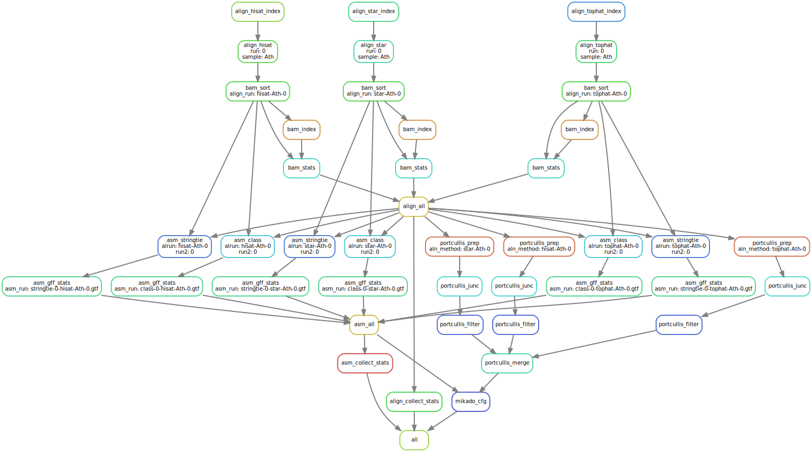
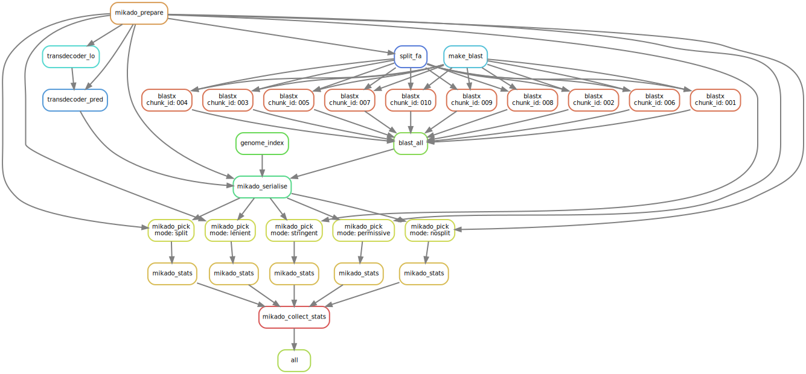

.. _Snakemake: https://bitbucket.org/snakemake/snakemake/wiki/Home

.. _Daijin:

The Daijin pipeline for driving Mikado
======================================

No emperor or empress can lead its nation without a trusty chancellor to help him or her in organising the bureaucracy. Daijin, the Japanese minister, has the same role in Mikado - it smooths the path to go from a collection of read inputs (both RNA-Seq or long reads) to a polished assembly. The pipeline is based on Snakemake_ and supports natively three cluster management systems (SLURM, PBS and LSF), plus any DRMAA-compliant batch submission system.

.. _daijin-configure:

Configure
~~~~~~~~~

.. _daijin-assemble:

Assemble
~~~~~~~~

.. _daijin-mikado:

Mikado
~~~~~~

